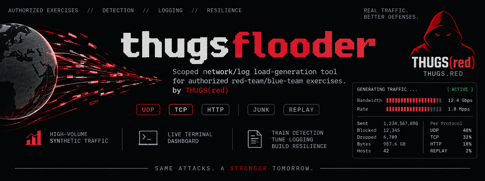

<p align="center">
  
</p>

<h1 align="center">thugsflooder</h1>

<p align="center">
  <em>SAME ATTACKS. A STRONGER TOMORROW.</em><br>
  <em>A single-binary CLI/TUI that floods an authorized lab with sustained, high-volume synthetic
  network traffic — UDP/TCP/HTTP junk plus replayed traffic recordings — so a blue team can train
  against, and a SOC can tune detection and logging for, what a real large-scale flood looks like.</em><br>
  <a href="https://thugs.red"><strong>thugs.red</strong></a>
</p>

<p align="center">
  
  
  
  
  
  
</p>

---

Point `thugsflooder` at an allowlist of your own lab's hosts and it hammers them with concurrent
UDP/TCP/HTTP junk (configurable rate and worker count per target) and, optionally, a replay of a
recorded traffic pattern — all while a live terminal dashboard shows a bandwidth/rate bar graph, a
scrolling log/status pane, and a running summary of sent/blocked/dropped/bytes/hosts. It runs
until you stop it, generating exactly the kind of sustained volume that's meant to light up a SOC
and stress-test log pipelines — deliberately, in your own environment, so you find out what that
looks like before an attacker does.

It will not do any of that by accident: nothing happens without `--i-understand-the-risk`, nothing
is ever sent to a host:port:protocol that isn't explicitly listed in your `--config` file (checked
twice — at load and again before every single send), every attempt is permanently written to an
audit log that can't be turned off, and every payload it sends carries an identifiable marker. It
generates its own synthetic noise; it is not a channel for injecting or disguising anything else.

<p align="center">
  <code>thugsflooder run --i-understand-the-risk --config targets.yaml</code>
</p>

## What's in the box

| | |
|---|---|
| **Traffic generators** | UDP (held-open socket, junk datagrams), TCP (connect → write → close, connection-flood style), and HTTP (marked POST requests) — each run by a configurable pool of concurrent workers per target so throughput isn't capped by one connection's round-trip time. |
| **Replay** | a simple JSON-lines recording format (`proto`/`host`/`port`/`payload_b64`/`delay_ms`) for replaying a captured traffic pattern at original or scaled speed — no libpcap/cgo, so it cross-compiles cleanly everywhere thugsflooder does. |
| **Allowlist enforcement** | every target lives in a YAML config (`targets:` → host/ports/protocols). Loading validates it; every generator re-checks it immediately before every send — a recording file cannot be used to reach anything outside the allowlist. |
| **Audit trail** | append-only JSON-lines log of every sent/blocked/dropped attempt (timestamp, proto, host, port, bytes, result). Mandatory — the config loader refuses `/dev/null` or an unset path. |
| **Rate control** | a global token-bucket cap (`max_pps`) across every worker, plus `workers_per_target` to trade concurrency for throughput on RTT-bound protocols. |
| **Live dashboard** | a `bubbletea`/`lipgloss` TUI: a block-character bandwidth/rate sparkline, a scrolling log/status viewport, and a summary box (sent, blocked, dropped, bytes, active hosts, per-protocol counters). `--headless` prints the same stats as plain text instead. |
| **Gate** | no subcommand, flag, or config does anything without `--i-understand-the-risk` — every other invocation just prints the about/legal notice and usage help, and that's the *only* thing it ever prints unset. |
| **Under it** | **Go 1.27+**, `CGO_ENABLED=0`, one static binary per architecture. |

## Quick start

```bash
git clone https://github.com/kawaiipantsu/thugsflooder.git && cd thugsflooder
make build                                    # dist/<arch>/thugsflooder

./dist/amd64/thugsflooder gen-config targets.yaml    # write an example allowlist
$EDITOR targets.yaml                                  # point it at hosts you own/are authorized to test

./dist/amd64/thugsflooder run --i-understand-the-risk --config targets.yaml
./dist/amd64/thugsflooder run --i-understand-the-risk --config targets.yaml --headless --max-duration 10m
./dist/amd64/thugsflooder run --i-understand-the-risk --config targets.yaml --replay recording.jsonl --speed 2.0
```

Nothing runs without that flag — run it bare (or with `--help`) to see the about/legal notice
before you do anything else:

```bash
./dist/amd64/thugsflooder --help
```

### Config

```yaml
targets:
  - host: 10.0.0.5
    ports: [53, 123, 8080]
    protocols: [udp, tcp, http]
rate_limit:
  max_pps: 2000            # global cap across every worker
  workers_per_target: 8    # concurrent workers per target:port:protocol
audit_log: /var/log/thugsflooder/audit.jsonl   # mandatory, can't be /dev/null
```

See [`examples/targets.example.yaml`](examples/targets.example.yaml) and
[`examples/recording.example.jsonl`](examples/recording.example.jsonl) for the full formats, and
[`payloads/`](payloads/) for a ready-to-replay library of 187 entries across 9 traffic flavors
(HTTP, DNS, IRC, TCP banners, JSON APIs, and more) that runs as-is against the example allowlist
above.

### Packages

```bash
make build   # cross-compiled binaries -> dist/<arch>/thugsflooder
make deb     # .deb packages   -> dist/thugsflooder_<version>_<arch>.deb
make all     # both

sudo dpkg -i dist/thugsflooder_*_amd64.deb
```

Targets: `i386` (32-bit Intel), `amd64` (64-bit Intel), `armhf` (32-bit ARM), `arm64` (64-bit ARM)
— `dpkg-deb` doesn't care about the host architecture, so all four build from one Debian/Ubuntu box.

## How it works

`config.Load` parses and validates the allowlist YAML into a `Config` plus an `Allowlist` lookup
table; `generator.Manager` spins up a pool of `workers_per_target` goroutines per configured
target:port:protocol (`udp.go`/`tcp.go`/`http.go`), plus a `replay.go` worker per recording if one
is attached, all drawing from one shared `RateLimiter` token bucket. Every worker checks
`Allowlist.Allowed` immediately before it sends, and reports the outcome to both `stats.Stats`
(atomic counters + a rolling per-second rate history for the graph) and `audit.Logger` (the
permanent JSON-lines trail) no matter what happens. `tui.Model` redraws from a `stats.Snapshot()`
and the shared `logbuf.Buffer` on a 200ms tick; `--headless` reads the same `Stats` on a 1s tick
instead of building a screen.

## Layout

```
cmd/thugsflooder/        CLI entry point: flag parsing, the --i-understand-the-risk gate, dispatch
internal/
  about/                 the about/legal notice + usage help (the only unset output)
  config/                 allowlist YAML schema, load/validate, example-config template
  generator/              Manager, rate limiter, and the udp/tcp/http/replay workers
  recording/              the JSON-lines replay recording format
  audit/                  the mandatory append-only audit logger
  stats/                  atomic counters + rate history for the dashboard
  logbuf/                 shared ring buffer of log lines (TUI + headless)
  tui/                    bubbletea dashboard: sparkline, log viewport, stats box
examples/                 example targets.yaml and recording.jsonl
packaging/debian/         control file template + postinst notice used by `make deb`
```

## License

MIT — see [LICENSE](LICENSE).
